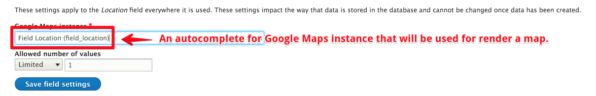
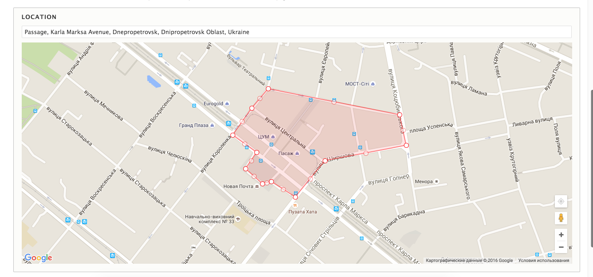
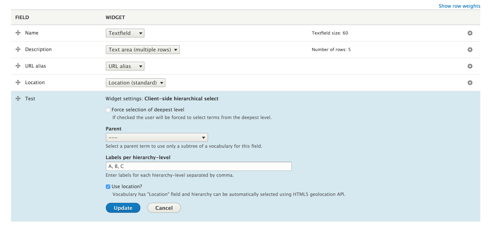

# Location Field

This module provides the `Location` field with map and an autocomplete for locations (Google Map API). With described tools you're able to instantly find a location and draw a polygon - its coordinates will be the value of a field.

The module depends on [Google Maps Instances](https://www.drupal.org/project/googlemaps) and provides an example instance which can be used for a field.

Also, a module extends a [Client-side hierarchical select](https://www.drupal.org/project/cshs) with possibility to prefill a hierarchy using HTML5 geolocation API. To use this possibility, bundle of `taxonomy_term` should have one or more fields of `location` type.

## Usage

- Use usual workflow to add a field to fieldable entity.
- Allow `Client-side hierarchical select` choose options for you - add `#use_location => TRUE` to element definition.
- Simplify content editing by automatically choosing hierarchy relying on value of `Location` field.

## Screenshots

