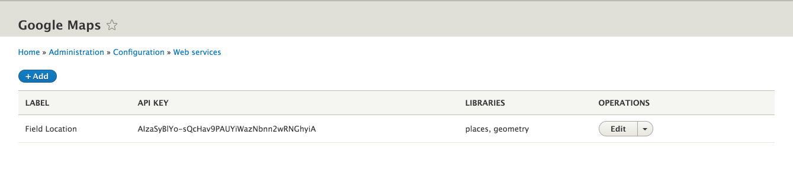
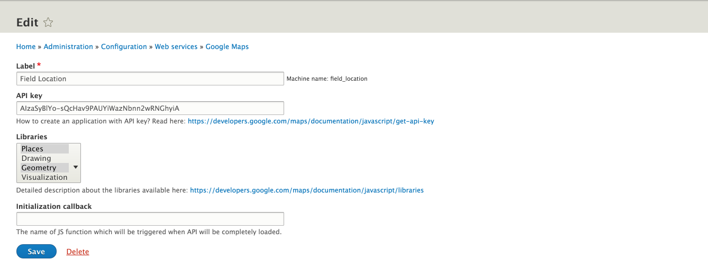

# Google Maps

This module provides the configuration entity which is needed for creating dynamic instances of the `Google Maps` JavaScript API.

## Usage

```php
$element['#attached']['library'][] = googlemaps_library($field->getSetting('googlemaps_library'));
```

## Screenshots



